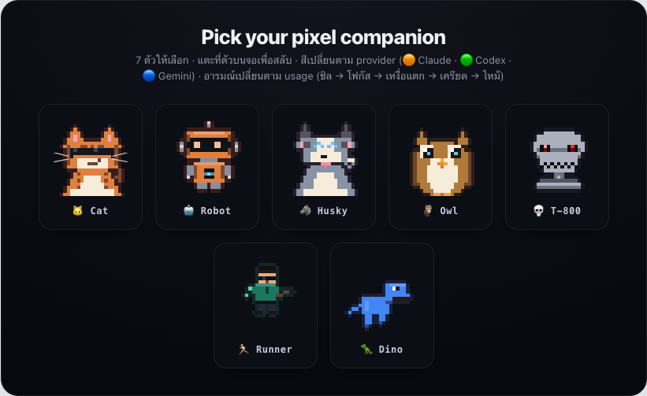
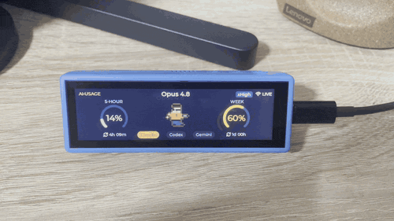
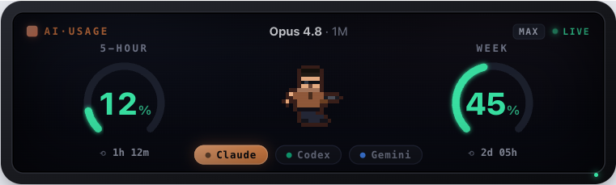
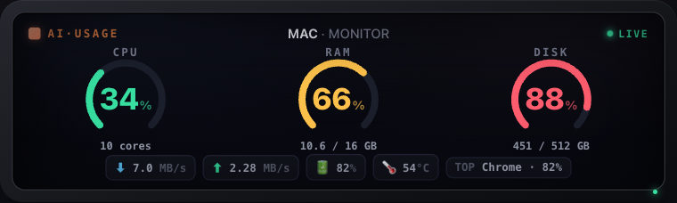
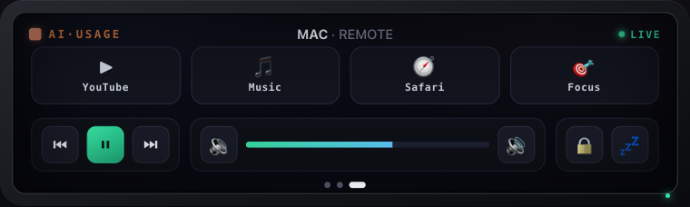
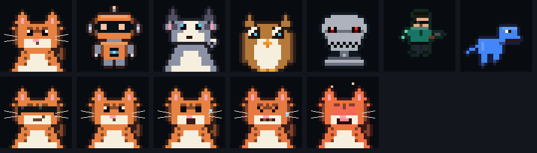

<div align="center">

# AI Usage Bar · ESP32

**Your Claude Code usage limits, live on a tiny desk display — with a pixel companion that panics when you're about to run out.**

A private, open-source desk gadget for the **Waveshare ESP32-S3-Touch-LCD-3.49**
(640×172 touch LCD). It shows your rolling **5-hour** and **weekly** Claude Code
limits as twin arc gauges, the model + effort you're on, and a live reset
countdown — plus a switchable **pixel companion** (🐱 🤖 🐺 🦉 💀 🏃 🦖) that
changes colour per provider and mood by usage.

And it's now a full tiny **Mac desk dashboard**: **swipe** between three screens (page dots
show where you are) — the usage bar, a live **system monitor** (CPU · RAM · Disk), and a
**Mac remote**.

Self-hosted: your token never leaves your Mac.

[](LICENSE)


<a href="https://github.com/sponsors/captainkie">
  
</a>
<a href="https://buymeacoffee.com/captainkiez">
  
</a>



<sub>Tap the companion to swap it · tap a provider pill to switch · it recolours + re-emotes</sub>



<sub>Real device — 3 swipe screens. <a href="docs/media/demo.mp4">Full-quality clip →</a></sub>

</div>

---

## What it does



- **Twin arc gauges** — `5-HOUR` and `WEEK` utilisation, traffic-light coloured
  (🟢 `<60%` · 🟡 `60–85%` · 🔴 `>85%`) with a live `⟲ resets in…` countdown.
- **Model + effort** up top (e.g. `Opus 4.8 · 1M` · `MAX`), just like the
  original menu-bar app.
- **Touch** — tap the provider pills (Claude / Codex / Gemini) or tap the
  companion to cycle through all seven.
- **A companion with feelings** — its fur/shell follows the active provider's
  colour and its mood follows your busiest gauge: chill 😎 → focus → sweat 😰 →
  stress → fried 🔥 (T-800's eye even dies at 99%).

### More than a usage bar — a Mac desk dashboard

All three ship today — **swipe** between them (page dots show where you are), all in the
same 640×172 gauge language:

- **① AI Usage** — the twin gauges above.
- **② Mac Monitor** — live **CPU · RAM · Disk** meters, plus network I/O, battery,
  temperature, and the top resource-hungry processes.
- **③ Mac Remote** — one-tap **shortcuts** (open YouTube / apps), **media** transport,
  **volume**, and **lock / screen** — the device drives your Mac through the bridge
  (allowlisted + paired, never a free-for-all).



<sub>**② Mac Monitor** — CPU · RAM · Disk as traffic-light arcs, plus network I/O, battery, temperature, and the top process.</sub>



<sub>**③ Mac Remote** — shortcuts (open YouTube / apps, or Claude), media transport, volume, and lock / screen — driven over the bridge.</sub>

▶ **[Play with all three in the live demo →](https://captainkie.github.io/ai-usage-esp32/design/mockup.html)** — swipe, scrub the meters, tap the remote.

> 🖥️ **Prefer it in your menu bar?** This is the desk-display sibling of
> **[AI Usage Bar for macOS](https://github.com/captainkie/ai-usage-bar)** — same data,
> same privacy stance. **Run both:** the menu-bar app while you work, this little
> screen glowing on your desk. They even share the exact same usage feed.

## How it works

```
  ┌─────────────── your Mac ───────────────┐        LAN         ┌──── ESP32-S3 ────┐
  │  Claude Code login (Keychain)           │      Wi-Fi         │  640×172 display  │
  │        │ read current token             │   http://mac:8787  │  twin gauges +    │
  │        ▼                                 │  ───────────────▶  │  pixel companion  │
  │  bridge ──▶ GET api.anthropic.com/…/usage│    /usage (JSON)   │  touch to switch  │
  └─────────────────────────────────────────┘                    └───────────────────┘
```

The **[bridge](bridge/)** is a tiny, zero-dependency Node service on your Mac. It
reads Claude Code's *current* OAuth token (refreshed by Claude Code itself, so it
never goes stale), calls Anthropic's official usage endpoint, and serves the
result as JSON on your LAN. The ESP32 only ever sees percentages, reset times,
and a model name — **your token stays on your Mac.**

Why a bridge and not talk to Anthropic directly from the ESP32? The token is
short-lived and lives in your Mac's Keychain; the bridge always reads the fresh
one. It also lets the device show the model + effort (read from your local
Claude Code files, which the ESP32 can't see).

## Quick start

**1. Run the bridge on your Mac** ([details →](bridge/README.md))

The turnkey path scaffolds everything and auto-starts at login:
```sh
cd bridge
./install-macos.sh 8787           # scaffolds ~/.config/ai-usage-bridge/actions.json,
                                  # prints your pairing token, starts on boot
```
It prints a **pairing token** — keep it handy for the device. Prefer the foreground?
`node ai-usage-bridge.mjs` (prints `http://<your-ip>:8787/usage`). Don't want the
remote screen? Install with `REMOTE=0 ./install-macos.sh 8787`.

**2. Flash the firmware** ([details →](firmware/README.md))

The firmware drops into Waveshare's `09_LVGL_V8_Test` example (which brings up
this board's panel + touch). Copy in the files from `firmware/ai-usage-esp32/`,
apply the small setup in the firmware README, and upload.

**3. Pair it over Wi-Fi.** On first boot it opens a captive portal
(`AI-Usage-Bar-Setup`). Join it, pick your network, then enter your **Mac's IP +
port (`8787`)** and the **pairing token** the bridge printed. The ESP32 is
**2.4GHz-only** — it can't see 5GHz networks, so join a 2.4GHz SSID.

That's it — `● 5h 18%  wk 57%` glowing on your desk, with a cat.

### Setting up the Mac Remote (screen ③)

The remote's tiles are allowlisted in `~/.config/ai-usage-bridge/actions.json`
(`apps` / `urls` / `shortcuts`) — edit that file to change what any tile does; all
tiles are configurable. Two tiles are worth a note:

- **LOCK** starts the macOS **screen saver** (`open -a ScreenSaverEngine`) — **no
  Accessibility permission needed**. For it to actually lock, turn on **Require
  password after screen saver begins** (System Settings → Lock Screen). The Mac
  stays awake, so Claude keeps running and the Remote keeps working.
- **Claude** opens **https://claude.ai** out of the box — no macOS Shortcut needed
  (the old **Focus** tile required a user-made Shortcut).

### Moving between networks (home ↔ office)

**Tap the LIVE indicator** (the Wi-Fi indicator, top-right of any screen) to reopen
the setup portal — change Wi-Fi or update the token, no reflashing needed.

The ESP32 can't join **WPA2-Enterprise** or captive-portal corporate Wi-Fi. On a
restrictive office network you have two tether-free options:

- **USB (no network at all):** keep the device plugged into your Mac over USB and
  run the bridge — it **auto-detects the USB port** and pushes updates over the
  cable, and **carries Remote actions back** too, so screen ③ still drives your Mac
  (no Wi-Fi, no pairing). Set `USB=0` to disable, or `USB_PORT=/dev/cu.…` to
  pin it. Perfect for carrying one device between home and office.
- **Phone hotspot (2.4GHz):** a Wi-Fi fallback if you'd rather stay wireless.

> If Anthropic's usage endpoint transiently rate-limits (HTTP 429 — it shares your
> token with the menu-bar app), the bridge serves the **last-known-good** reading,
> so the display never flickers to "no live data". It now **persists last-known-good
> to disk** (`~/.config/ai-usage-bridge/last-good.json`), so even a bridge restart —
> or a cold start during a 429 — shows your last real reading instead of blanking.

### Save your networks on a TF card (`pixie.json`)

Instead of re-typing Wi-Fi at each place, list several networks in a `pixie.json` file
at the **root of a TF card** (template: [`firmware/pixie.example.json`](firmware/pixie.example.json)):

- Pixie **auto-joins the strongest** saved network in range (WiFiMulti) — home, office,
  or phone hotspot — with no re-typing when you move.
- Leave `bridge_host` blank and it **auto-finds the Mac via mDNS** — no IP to type.
- The `token` (pairing token) travels with it too, so a new location needs nothing typed.

On first boot Pixie imports the card into the device's on-board flash and runs from there,
so you can **remove the card afterwards**. Pixie **never writes** to the card.

#### ⚠️ Security — please read before giving one away

- **Wi-Fi passwords live in the device's on-board flash (NVS).** NVS is **not encrypted** —
  someone with the board and a flash dumper could read them — but it's soldered on, so it's
  the higher bar. Treat Pixie like any gadget that remembers your Wi-Fi.
- **`pixie.json` on the TF card is plaintext**, readable on any computer. On first boot Pixie
  copies it into flash (*"import-and-forget"*), so **remove the card** afterwards and the
  password no longer rides on removable media. Keep the card inserted only if you want the
  config to survive a firmware reflash — and accept that whoever takes the card can read it.
- A card (when present) **wins over** the portal/flash values at boot. If you reconfigure via
  the setup portal with a card inserted, update `pixie.json` (or remove the card) or the card
  values return on the next boot.
- **The pairing token is a secret** — it gates the Remote and Voice features. If it leaks,
  rotate it at the bridge.
- **For a giveaway unit, use a guest / dedicated Wi-Fi**, not your main network, and hand it
  over with the card removed (config already in flash).

## The companions

| | | | | | | |
|:-:|:-:|:-:|:-:|:-:|:-:|:-:|
| 🐱 Cat | 🤖 Robot | 🐺 Husky | 🦉 Owl | 💀 T-800 | 🏃 Runner | 🦖 Dino |

Every one recolours to the active provider (🟠 Claude · 🟢 Codex · 🔵 Gemini) and
emotes with usage. The pixel engine (`firmware/ai-usage-esp32/mascot.c`) is
verified on a host to match the web preview:



**Want to see it move first?** ▶ **[Open the live demo →](https://captainkie.github.io/ai-usage-esp32/design/mockup.html)**
or `design/mockup.html` locally — an interactive, pixel-accurate simulation of the 640×172
screen. Append `?gallery` to see every companion at once.

## Hardware

**[Waveshare ESP32-S3-Touch-LCD-3.49](https://www.waveshare.com/esp32-s3-touch-lcd-3.49.htm)** —
ESP32-S3R8, 8MB PSRAM / 16MB Flash, 3.49″ 640×172 IPS, AXS15231B (QSPI + I²C
touch), Wi-Fi + BT5, 6-axis IMU, Li-po connector (so it can run untethered).
Full notes + driver rationale in **[esp32/HARDWARE.md](esp32/HARDWARE.md)**.

## Roadmap

- **USB-serial transport** *(available)* — runs tether-free over the USB cable it's
  already powered by; no Wi-Fi or pairing needed. Auto-detected by the bridge, and now
  **bidirectional** — it carries live data to the device **and Remote actions back**.
  Ideal for carrying a single device between home and office.
- **Seamless connectivity** *(in progress / planned)* — auto-join multiple saved
  networks (WiFiMulti: home / office / hotspot), auto-discover the Mac via mDNS (no
  typing its IP), and a TF-card config file — so switching between locations
  needs no re-typing at all.
- **Bluetooth (BLE) transport** *(planned)* — a wireless, network-free link to the Mac.
- **On-device AI voice assistant** *(planned)* — the board has a dual-mic array + audio
  codec (ES7210 ADC / ES8311 DAC + speaker header); wake-word or push-to-talk to an LLM.

## Privacy

The only outbound network call is the bridge → `api.anthropic.com`, using your
own token, over HTTPS. No accounts, no analytics, no telemetry. The token is
read locally, never written to disk by the bridge, and never sent to the device
or anywhere else.

## Security & privacy

- **[SECURITY.md](SECURITY.md)** — threat model, what's accessed, how to report a vulnerability.
- **[PRIVACY.md](PRIVACY.md)** — exactly what is read, sent, and never sent.

## Support

If this made your desk a little more fun, you can sponsor the project:

- 💜 **[GitHub Sponsors → captainkie](https://github.com/sponsors/captainkie)**
- ☕ **[Buy me a coffee → captainkiez](https://buymeacoffee.com/captainkiez)**

## Credits

- Concept + macOS app: **[AI Usage Bar](https://github.com/captainkie/ai-usage-bar)** by captainkie / Fosivo Labs.
- Board + display bring-up: **[Waveshare](https://github.com/waveshareteam/ESP32-S3-Touch-LCD-3.49)**.
- Built to be given away. MIT licensed — see [LICENSE](LICENSE).
